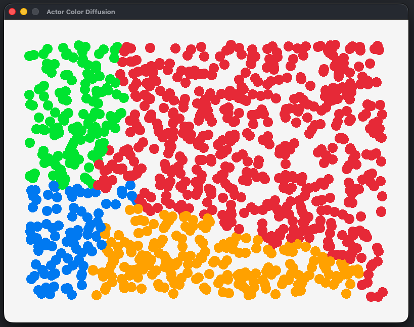

# Actor / Message Passing benchmark

Has 2 branches:
- With Raylib animation
- Only time measurement

## Problem description
We have a set of nodes.
Initially most of the nodes don't have any color. Several random nodes initialized with their colors.
Nodes with colors are starting sending messages to the closest node. When the node receive messages of the specific color that greater than threshold - this color is becoming the color of this node.
After that the node stop receiving color messages (it sends back message that now it has its own color).
Now it is finding its own closest non-colored node and start send messages to this node.

There is also a coordinator node (main thread). Every time any node is getting any color it sends a message to coordinator and letting him know the color.
In Raylib version the data updated by coordinator is also used for animation.

## Building the project
Run inside the folder:
```
dub run raylib-d:install
dub build
```

## Example of running


## License
MIT
